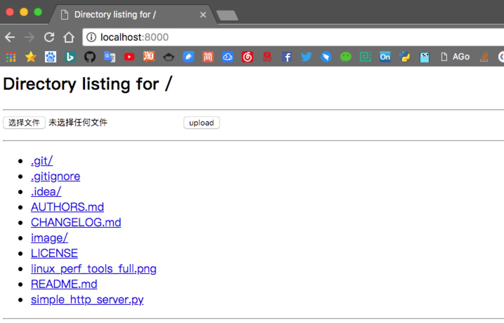

# simple_http_server

[](https://travis-ci.org/freelamb/simple_http_server)

## Features

- ✔ simple
- ✔ upload
- ✔ download

## Usage
```bash
# get code
$ git clone https://github.com/freelamb/simple_http_server.git

# enter directory
$ cd simple_http_server

# run server
$ python simple_http_server.py 8000

# run as docker container
# 1.build the image('.' below refer to the root path of this project)
docker build -t freelamb/simple_http_server .
# 2.run the container using the image built just now in docker 
docker run 
  --name simple_http_server \ 
  -p 8000:8000 \ 
  -v /opt/data:/opt/data \ 
  -d freelamb/simple_http_server:latest
```

## Example



## Todo
- [ ] support Multi-threaded
- [ ] add docker images
- [ ] add to pypi
## Contributing

1. Check for open issues or open a fresh issue to start a discussion around a feature idea or a bug.
2. Fork [the repository](https://github.com/freelamb/simple_http_server)_ on GitHub to start making your changes to the **master** branch (or branch off of it).
3. Write a test which shows that the bug was fixed or that the feature works as expected.
4. Send a pull request and bug the maintainer until it gets merged and published. :) Make sure to add yourself to [AUTHORS_](AUTHORS.md).

## Changelog

[Changelog](CHANGELOG.md)

## reference

<https://github.com/tualatrix/tools/blob/master/SimpleHTTPServerWithUpload.py>

## License

[MIT](https://tldrlegal.com/license/mit-license)
