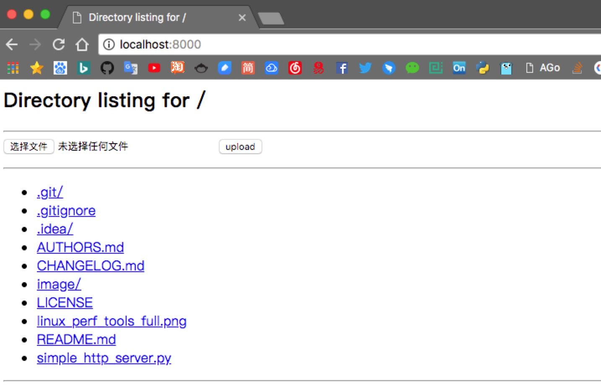

# simple_http_server

[English](README.md) | [简体中文](README.zh-CN.md)

## 功能

- 简单易用
- 支持上传
- 支持批量上传
- 支持下载
- 支持 Python 2 和 Python 3
- 支持多线程

## 使用方法

```bash
# 获取代码
$ git clone https://github.com/freelamb/simple_http_server.git

# 进入目录
$ cd simple_http_server

# 启动服务
$ python simple_http_server.py 8000

# 可选：将上传请求限制为 1 GiB
$ python simple_http_server.py --max-upload-size 1024 8000

# 在可信网络中允许其他主机访问
$ python simple_http_server.py --bind 0.0.0.0 8000
```

发布版本后，可以从 PyPI 安装：

```bash
$ python -m pip install simple-http-server-upload
$ simple-http-server-upload 8000
```

```bash
# 作为 Docker 容器运行
# 1. 构建镜像（下面的 "." 表示项目根目录）
docker build -t freelamb/simple_http_server .

# 2. 使用刚刚构建的镜像启动容器
docker run
  --name simple_http_server \
  -p 8000:8000 \
  -v /opt/data:/opt/data \
  -d freelamb/simple_http_server:latest
```

## 安全说明

这个服务用于可信环境中的临时文件共享。默认绑定地址是 `127.0.0.1`；只有在明确希望其他主机连接时，才使用 `--bind 0.0.0.0`。

上传文件名会被清理，上传结果和目录列表会对用户可控文本做 HTML 转义。上传大小默认不设上限；如需限制上传大小，可以在可信环境中使用 `--max-upload-size MIB`。

## 示例



## 待办

- [ ] 添加 Docker 镜像

## 贡献

1. 检查已有 issue，或新建 issue 来讨论功能想法或问题。
2. 在 GitHub 上 fork [本仓库](https://github.com/freelamb/simple_http_server)，从 **master** 分支开始修改，或基于它创建新分支。
3. 编写测试，证明问题已经修复，或功能符合预期。
4. 提交 pull request，并持续跟进直到合并和发布。记得把自己添加到 [AUTHORS](AUTHORS.md)。

## 更新日志

[更新日志](CHANGELOG.md)

## 参考

<https://github.com/tualatrix/tools/blob/master/SimpleHTTPServerWithUpload.py>

## 许可证

[MIT](https://tldrlegal.com/license/mit-license)
